# ScaleAlpha.ai 用户流程图 (User Flow)

> **文档说明**：本文档使用 Mermaid 流程图描述 ScaleAlpha.ai 平台的用户交互流程、决策路径和状态转换。

---

## 📋 目录

1. [核心用户旅程](#核心用户旅程)
2. [工作流状态转换图](#工作流状态转换图)
3. [登录与认证流程](#登录与认证流程)
4. [信息中心导航流程](#信息中心导航流程)
5. [机会发现流程](#机会发现流程)
6. [计划制定流程](#计划制定流程)
7. [一键交易流程](#一键交易流程)
8. [路由守卫决策树](#路由守卫决策树)
9. [数据流转图](#数据流转图)

---

## 1. 核心用户旅程

### 新用户完整旅程（Happy Path）

```mermaid
graph TD
    Start([用户首次访问]) --> Home[首页 /home]
    Home --> Login{是否登录?}
    Login -->|否| LoginPage[登录页 /login]
    Login -->|是| Info[信息中心 /info]
    LoginPage --> LoginSuccess[登录成功]
    LoginSuccess --> Info
    
    Info --> BrowseInfo[浏览市场/股票/ETF信息]
    BrowseInfo --> InfoDetail[查看详情页]
    InfoDetail --> AddWatchlist[添加到自选股]
    AddWatchlist --> DecideNext{下一步?}
    
    DecideNext -->|开始投资| PortfolioInput[我的投资信息 /portfolio-input]
    DecideNext -->|继续浏览| Info
    
    PortfolioInput --> FillForm[填写个人信息]
    FillForm --> RiskAssessment[风险评估]
    RiskAssessment --> SubmitInfo[提交信息]
    SubmitInfo --> UnlockOpportunity[✅ 解锁机会发现]
    
    UnlockOpportunity --> Opportunity[机会发现 /opportunity]
    Opportunity --> ViewReports[查看AI生成的机会报告]
    ViewReports --> SaveReports[保存感兴趣的报告]
    SaveReports --> UnlockPlanning[✅ 解锁计划制定]
    
    UnlockPlanning --> Planning[计划制定 /planning]
    Planning --> CreatePlan[创建投资计划]
    CreatePlan --> ReviewPlan[审核计划细节]
    ReviewPlan --> SavePlan[保存计划]
    SavePlan --> UnlockTrading[✅ 解锁一键交易]
    
    UnlockTrading --> Trading[一键交易 /scalealpha/trading]
    Trading --> ConnectBroker[连接券商账户]
    ConnectBroker --> SelectPlan[选择要执行的计划]
    SelectPlan --> ConfirmTrade[确认交易]
    ConfirmTrade --> ExecuteTrade[执行交易]
    ExecuteTrade --> TradeSuccess[✅ 交易完成]
    
    TradeSuccess --> Review[交易复盘 /review]
    Review --> ViewPerformance[查看绩效]
    ViewPerformance --> End([完成完整流程])
    
    style Start fill:#e1f5e1
    style End fill:#e1f5e1
    style UnlockOpportunity fill:#fff3cd
    style UnlockPlanning fill:#fff3cd
    style UnlockTrading fill:#fff3cd
    style TradeSuccess fill:#d4edda
```

---

## 2. 工作流状态转换图

### 六步核心工作流（WorkflowNav）

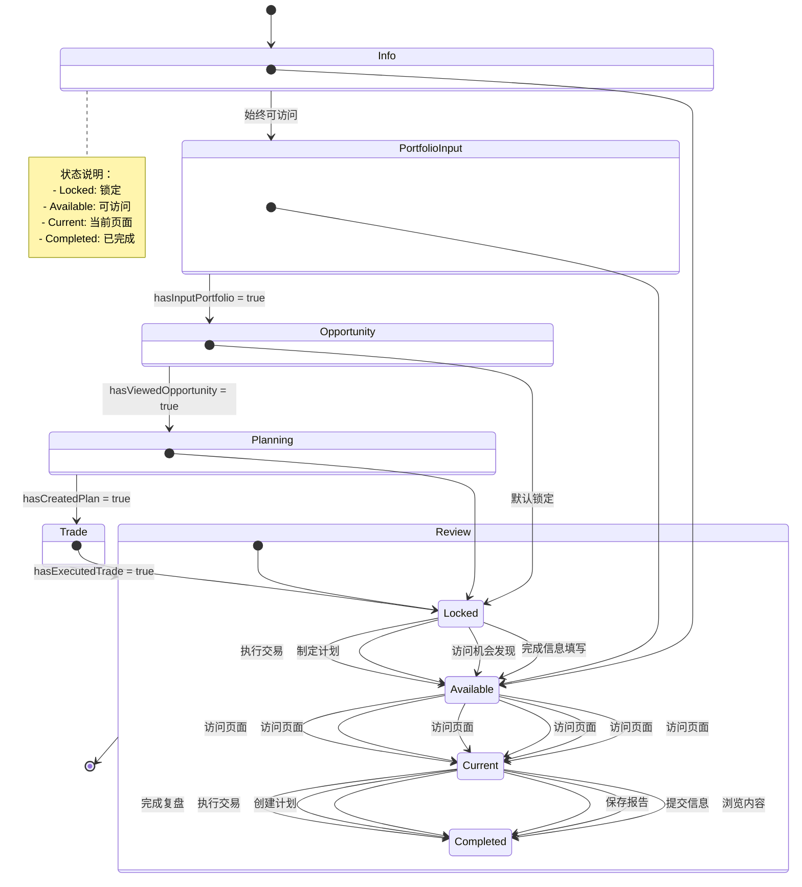

---

## 3. 登录与认证流程

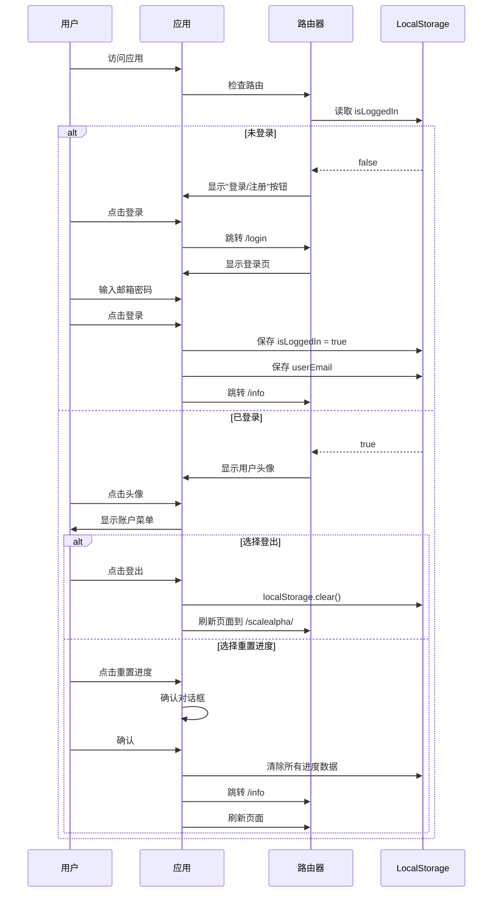

---

## 4. 信息中心导航流程

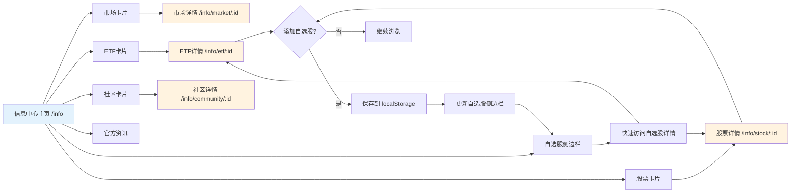

---

## 5. 机会发现流程

```mermaid
graph TD
    Start([用户访问 /opportunity]) --> CheckAuth{已填写<br/>投资信息?}
    
    CheckAuth -->|否| Redirect[重定向到 /portfolio-input]
    Redirect --> PortfolioInput[填写投资信息]
    PortfolioInput --> ReturnOpportunity[返回机会发现]
    
    CheckAuth -->|是| LoadPage[加载机会发现页面]
    LoadPage --> GenerateReports[AI生成机会报告]
    
    GenerateReports --> DisplayReports[展示报告卡片]
    DisplayReports --> UserAction{用户操作}
    
    UserAction -->|查看详情| ViewDetail[/opportunity/report/:id]
    ViewDetail --> ReadDetail[阅读详细分析]
    ReadDetail --> BackToList[返回列表]
    BackToList --> UserAction
    
    UserAction -->|保存报告| OpenSaveDialog[打开保存对话框]
    OpenSaveDialog --> SelectCategory[选择分类]
    SelectCategory --> SaveToStorage[保存到 localStorage]
    SaveToStorage --> UpdateUI[更新UI显示已保存]
    UpdateUI --> UnlockNext[✅ 解锁计划制定]
    
    UserAction -->|分类持仓| OpenClassifyDialog[打开分类对话框]
    OpenClassifyDialog --> ClassifyHoldings[对持仓分类]
    ClassifyHoldings --> SaveClassification[保存分类结果]
    SaveClassification --> UserAction
    
    UserAction -->|继续浏览| DisplayReports
    
    UnlockNext --> NextStep[可访问 /planning]
    
    style CheckAuth fill:#fff3cd
    style UnlockNext fill:#d4edda
    style Redirect fill:#f8d7da
```

---

## 6. 计划制定流程

```mermaid
graph TD
    Start([访问 /planning]) --> CheckUnlock{已查看<br/>机会发现?}
    
    CheckUnlock -->|否| ShowLocked[显示锁定状态]
    ShowLocked --> RedirectOpp[重定向到 /opportunity]
    
    CheckUnlock -->|是| LoadPlanning[加载计划制定页面]
    LoadPlanning --> ShowSavedReports[显示已保存的机会报告]
    
    ShowSavedReports --> UserSelect{用户选择}
    
    UserSelect -->|选择报告| SelectReport[选中一个或多个报告]
    SelectReport --> CreatePlan[点击"创建计划"]
    
    CreatePlan --> FillPlanDetails[填写计划详情]
    FillPlanDetails --> SetAmount[设置投资金额]
    SetAmount --> SetTimeframe[设置时间框架]
    SetTimeframe --> SetStrategy[选择策略]
    SetStrategy --> ReviewPlan[预览计划]
    
    ReviewPlan --> ConfirmPlan{确认计划?}
    ConfirmPlan -->|否| FillPlanDetails
    ConfirmPlan -->|是| SavePlan[保存计划]
    
    SavePlan --> UpdateStorage[更新 localStorage]
    UpdateStorage --> ShowPlanList[显示在计划列表]
    ShowPlanList --> MarkComplete[✅ 标记 hasCreatedPlan]
    MarkComplete --> UnlockTrading[解锁一键交易]
    
    UserSelect -->|查看已有计划| ViewPlanList[查看计划列表]
    ViewPlanList --> SelectExisting[选择已有计划]
    SelectExisting --> ViewPlanDetail[查看计划详情 /planning/:id]
    
    ViewPlanDetail --> EditPlan{编辑计划?}
    EditPlan -->|是| FillPlanDetails
    EditPlan -->|否| BackToList[返回列表]
    BackToList --> UserSelect
    
    UnlockTrading --> NextStep[可访问 /scalealpha/trading]
    
    style CheckUnlock fill:#fff3cd
    style MarkComplete fill:#d4edda
    style ShowLocked fill:#f8d7da
```

---

## 7. 一键交易流程

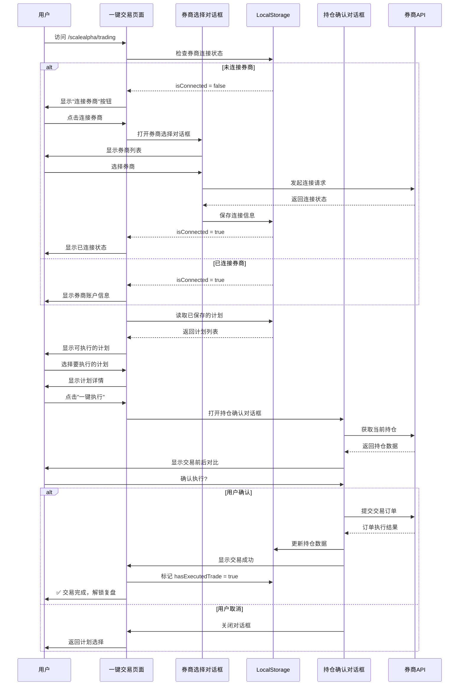

---

## 8. 路由守卫决策树

```mermaid
graph TD
    Start([用户访问路由]) --> GuardCheck{路由守卫检查}
    
    GuardCheck --> CheckUserInfo{需要用户信息?}
    
    CheckUserInfo -->|是| HasUserInfo{已填写<br/>用户信息?}
    CheckUserInfo -->|否| CheckReports{需要保存报告?}
    
    HasUserInfo -->|否| RedirectInput[重定向到 /portfolio-input]
    HasUserInfo -->|是| CheckReports
    
    CheckReports -->|是| HasReports{已保存报告?}
    CheckReports -->|否| AllowAccess[✅ 允许访问]
    
    HasReports -->|否| RedirectOpp[重定向到 /opportunity]
    HasReports -->|是| CheckWorkflow{工作流步骤<br/>是否解锁?}
    
    CheckWorkflow -->|否| RedirectPrev[重定向到前置步骤]
    CheckWorkflow -->|是| AllowAccess
    
    RedirectInput --> InputPage[/portfolio-input]
    RedirectOpp --> OppPage[/opportunity]
    RedirectPrev --> PrevPage[前置页面]
    
    AllowAccess --> MarkVisited[标记页面已访问]
    MarkVisited --> UpdateProgress[更新工作流进度]
    UpdateProgress --> RenderPage[渲染目标页面]
    
    style GuardCheck fill:#fff3cd
    style AllowAccess fill:#d4edda
    style RedirectInput fill:#f8d7da
    style RedirectOpp fill:#f8d7da
    style RedirectPrev fill:#f8d7da
```

### 路由守卫规则表

| 路由 | 需要用户信息 | 需要保存报告 | 工作流前置条件 | 失败重定向 |
|------|-------------|-------------|---------------|-----------|
| `/info` | ❌ | ❌ | 无 | - |
| `/portfolio-input` | ❌ | ❌ | 无 | - |
| `/opportunity` | ✅ | ❌ | hasInputPortfolio | `/portfolio-input` |
| `/planning` | ❌ | ❌ | hasViewedOpportunity | `/opportunity` |
| `/scalealpha/trading` | ❌ | ❌ | hasCreatedPlan | `/planning` |
| `/trading` | ✅ | ❌ | 无 | `/portfolio-input` |
| `/portfolio` | ✅ | ❌ | 无 | `/portfolio-input` |
| `/alerts` | ✅ | ❌ | 无 | `/portfolio-input` |
| `/event` | ✅ | ❌ | 无 | `/portfolio-input` |
| `/history` | ✅ | ❌ | 无 | `/portfolio-input` |
| `/backtest` | ✅ | ❌ | 无 | `/portfolio-input` |
| `/blog` | ❌ | ❌ | 无 | - |
| `/insight` | ❌ | ❌ | 无 | - |

---

## 9. 数据流转图

### LocalStorage 数据架构

```mermaid
graph TB
    subgraph "用户认证"
        Auth1[isLoggedIn]
        Auth2[userEmail]
    end
    
    subgraph "用户配置"
        Profile1[scaleAlpha_userProfile]
        Profile2[portfolio_info_submitted]
        Profile3[portfolio_input_data]
        Profile4[portfolio_last_saved]
    end
    
    subgraph "投资数据"
        Invest1[user_holdings]
        Invest2[riskAssessmentResult]
        Invest3[scaleAlpha_savedReports]
        Invest4[opportunity_report_categories]
    end
    
    subgraph "自选股与设置"
        Watch1[scaleAlpha_watchlists]
        Watch2[scaleAlpha_selectedGroup]
        Watch3[scaleAlpha_watchlists_version]
        Settings[scaleAlpha_settings]
    end
    
    subgraph "工作流进度"
        Workflow[workflow_progress]
        Workflow --> WF1[hasViewedInfo]
        Workflow --> WF2[hasInputPortfolio]
        Workflow --> WF3[hasViewedOpportunity]
        Workflow --> WF4[hasCreatedPlan]
        Workflow --> WF5[hasExecutedTrade]
        Workflow --> WF6[hasReviewedTrade]
    end
    
    subgraph "券商连接"
        Broker[scaleAlpha_brokerAccount]
    end
    
    LoginPage --> Auth1
    LoginPage --> Auth2
    
    PortfolioInputPage --> Profile2
    PortfolioInputPage --> Profile3
    PortfolioInputPage --> Profile4
    PortfolioInputPage --> Profile1
    PortfolioInputPage --> Invest1
    PortfolioInputPage --> Invest2
    
    OpportunityPage --> Invest3
    OpportunityPage --> Invest4
    
    InfoPage --> Watch1
    InfoPage --> Watch2
    InfoPage --> Watch3
    
    OneClickTradingPage --> Broker
    
    AllPages[所有页面] --> Workflow
    
    style Auth1 fill:#e3f2fd
    style Auth2 fill:#e3f2fd
    style Workflow fill:#fff3e0
    style Invest3 fill:#e8f5e9
```

### 组件间数据传递

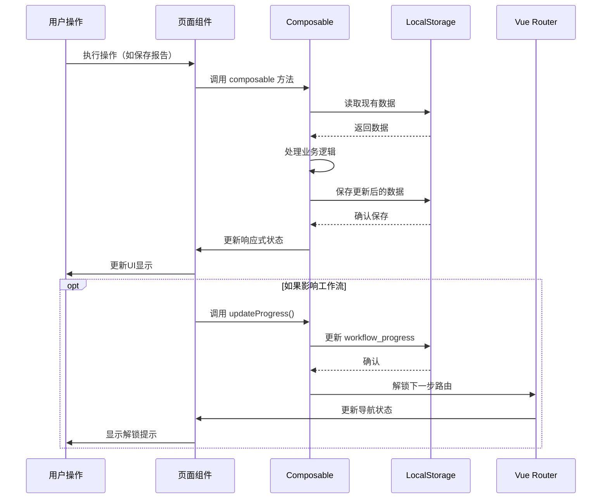

---

## 10. 异常处理流程

### 数据丢失恢复

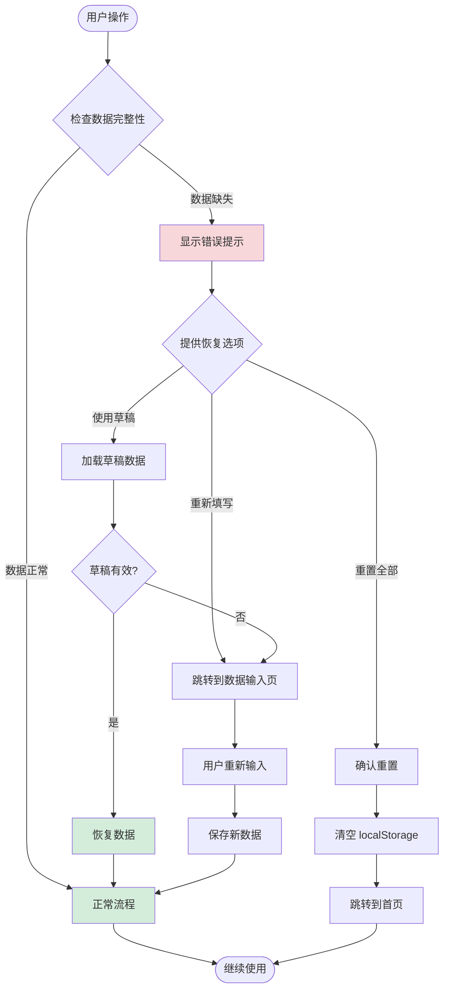

### 网络错误处理

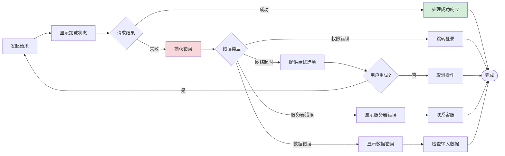

---

## 📊 用户行为统计点

### 关键埋点位置

| 页面/功能 | 埋点事件 | 触发时机 |
|----------|---------|---------|
| `/info` | `page_view_info` | 进入信息中心 |
| `/info/stock/:id` | `view_stock_detail` | 查看股票详情 |
| 自选股 | `add_to_watchlist` | 添加自选股 |
| `/portfolio-input` | `start_input_portfolio` | 开始填写信息 |
| `/portfolio-input` | `submit_portfolio` | 提交投资信息 |
| `/opportunity` | `view_opportunity_report` | 查看机会报告 |
| `/opportunity` | `save_opportunity_report` | 保存机会报告 |
| `/planning` | `create_plan` | 创建投资计划 |
| `/planning/:id` | `edit_plan` | 编辑计划 |
| `/scalealpha/trading` | `connect_broker` | 连接券商 |
| `/scalealpha/trading` | `execute_trade` | 执行交易 |
| WorkflowNav | `click_workflow_step` | 点击工作流步骤 |
| 导航栏 | `click_nav_locked` | 点击锁定的导航项 |

---

## 🔄 工作流完成度追踪

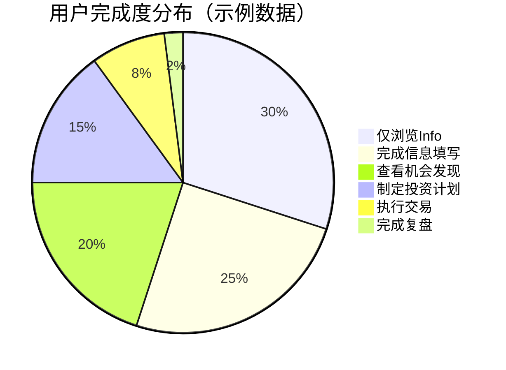

---

## 📝 用户旅程时间线

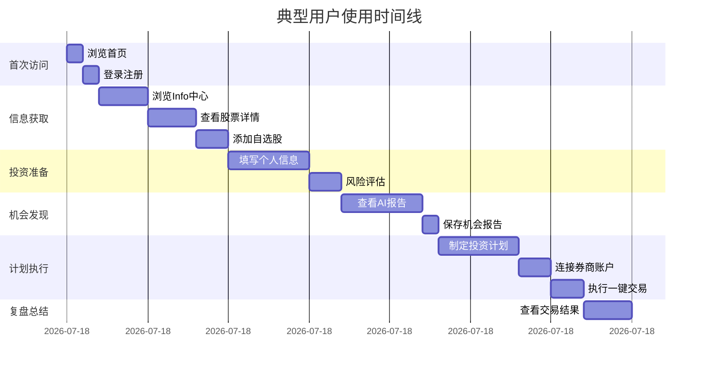

---

## 🎯 关键决策点分析

### 用户流失风险点

1. **登录页** → 登录流程过于复杂
   - **优化建议**: 支持社交账号登录，减少输入步骤

2. **PortfolioInput** → 信息填写过长
   - **优化建议**: 分步填写，保存草稿，显示进度条

3. **Opportunity** → 报告内容难以理解
   - **优化建议**: 增加视频讲解，简化专业术语

4. **Planning** → 计划制定决策困难
   - **优化建议**: 提供模板计划，智能推荐参数

5. **Trading** → 券商连接失败
   - **优化建议**: 提供详细错误说明，多券商备选

---

## 🔐 安全检查点

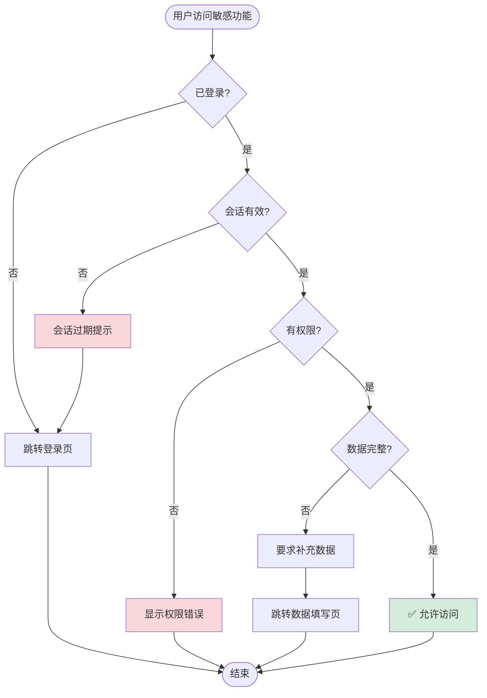

---

**文档版本**: v1.0  
**最后更新**: 2024年12月  
**维护者**: ScaleAlpha.ai Team

---

## 附录：Mermaid 图表说明

本文档使用 Mermaid 语法绘制流程图，支持在以下平台渲染：
- GitHub Markdown
- GitLab Markdown  
- VS Code (with Mermaid extension)
- Typora
- 在线工具: https://mermaid.live/

如需编辑图表，可复制代码块到 Mermaid 在线编辑器进行修改。
